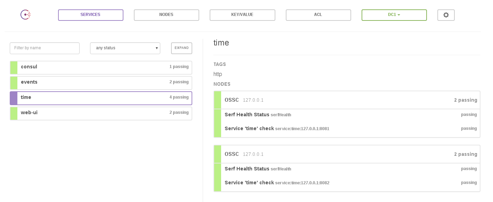
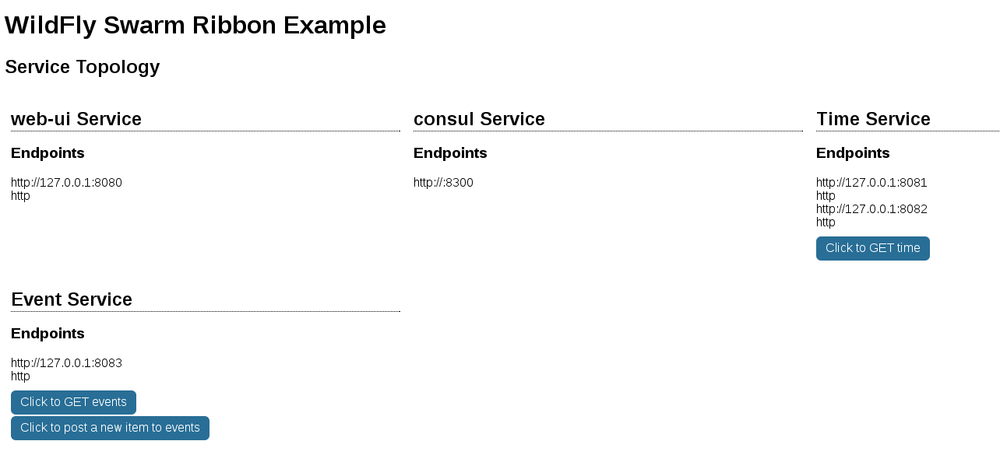

# ribbon-hystrix-consul

クライアントロードバランシング、サーキットブレーカ、サービスディスカバリのサンプルです。

## Consul の実行

Consul と Consul Web UI を以下からダウンロードし、適当なパスにインストールします。

https://www.consul.io/downloads.html

``` sh
./consul agent --ui-dir=/path/to/consul_web_ui/ --data-dir=/tmp/consul -bind 127.0.0.1 -server -bootstrap
```

## アプリケーションのビルド

``` sh
./mvnw clean package
```

## サービスの起動

このサンプルは以下のサービスからなります。

* time: 時刻を返すサービス
* events: time サービスを利用し、イベント情報を返すサービス
* web-ui: time/events サービスのクライアント フロントエンド 

### web-ui の起動

``` sh
java -jar web-ui/target/web-ui-swarm.jar
```

### time の起動(1つ目)

``` sh
java -jar time/target/time-swarm.jar -Dswarm.port.offset=1
```

### time の起動(2つ目)

``` sh
java -jar time/target/time-swarm.jar -Dswarm.port.offset=2
```

### events の起動

``` sh
java -jar events/target/events-swarm.jar -Dswarm.port.offset=3
```

## Consul UI でサービス登録状況の確認

ここまで起動できたら各サービスが Consul に登録されていることを確認しましょう。

以下にブラウザでアクセスし、Consul UI を表示します。

http://localhost:8500/

各種サービスが登録されていることが確認できます。



## Web UI へアクセス

次に Web UI へアクセスします。

http://localhost:8080/




## クライアントサイド ロードバランシング

Web UI で各種ボタンをクリックしてみます。

Time Service はアクセスがあるたびにログをコンソールに出力しますが、
2 プロセスに対してラウンドロビンで実行されていることが確認できます。

## サーキットブレーカ

Event Service は時刻表示に Time Service に依存していますが、
Time Service を 2 プロセスともダウンさせると、
暫定的なレスポンスとして 12 (h) とだけ返します。
エラーの伝播が食い止められています。