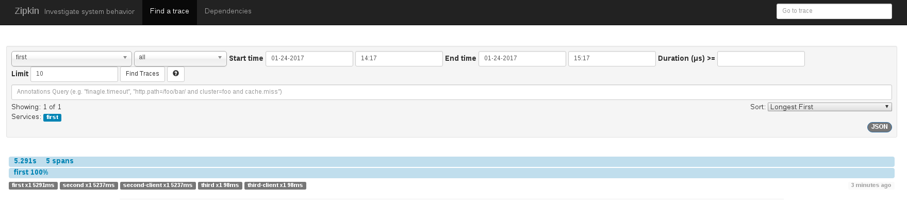

# zipkin

Zipkin を利用したサービスのトレーシングを行うサンプルです。

## Docker のインストール

Docker をインストールします。

インストールは下記ドキュメントを参照ください。

* https://docs.docker.com/engine/installation/

### Zipkin の起動

``` sh
docker run -it -d -p 9411:9411 openzipkin/zipkin:1.19.3
```

## アプリケーションのビルド

``` sh
./mvnw clean package
```

## 3 つのサービスを起動

このサンプルは first/second/third という 3 つのサービスからなり、
first -> second -> third という順序で呼び出されます。

### first サービスの起動

``` sh
java -jar first/target/first-swarm.jar
```

### second サービスの起動

``` sh
java -jar second/target/second-swarm.jar -Dswarm.port.offset=200
```

### third サービスの起動

``` sh
java -jar third/target/third-swarm.jar -Dswarm.port.offset=300
```

## API へのアクセス

以下のように first サービスの API にアクセスします。

``` sh
time curl localhost:8080
```

すると、レスポンスが返ってくるまでに 5 秒ほどかかっていることがわかります。

``` sh
ONE TWO THREE
0.00user 0.00system 0:05.34elapsed 0%CPU (0avgtext+0avgdata 7404maxresident)k
0inputs+0outputs (0major+424minor)pagefaults 0swaps
```

サービスのトレース状況を確認するために、Zipkin にアクセスします。

http://localhost:9411/

左上のサービス名を選択するところから `first` を選択し、`Find Traces` をクリックすると
結果が下部に表示されます。



結果をクリックすると、以下のようにそれぞれの処理時間が表示されます。


どうやら second サービスが遅いようですね。